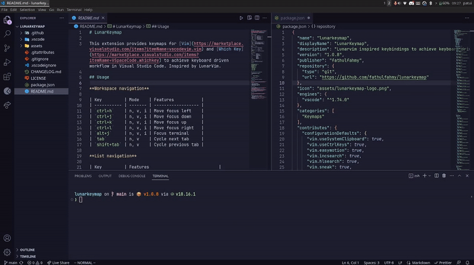
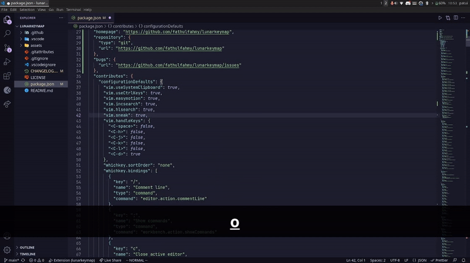
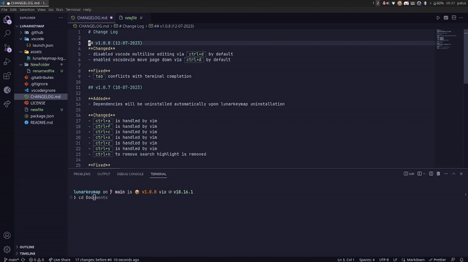
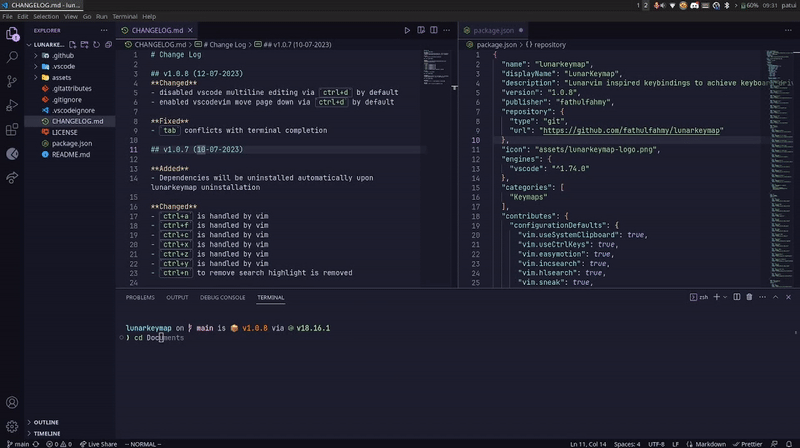
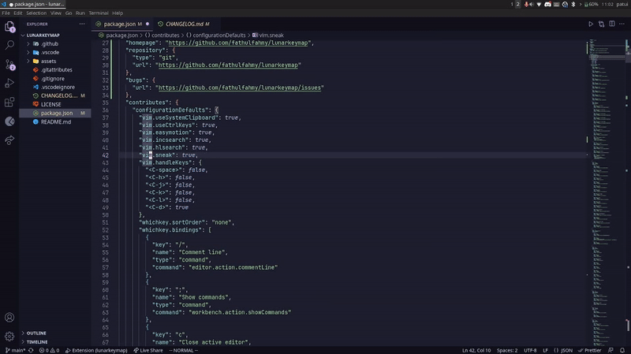
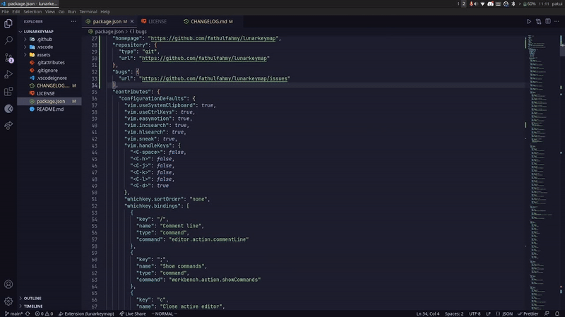

# LunarKeymap

This extension provides keymaps for [Vim](https://marketplace.visualstudio.com/items?itemName=vscodevim.vim) and [Which Key](https://marketplace.visualstudio.com/items?itemName=VSpaceCode.whichkey) to achieve keyboard driven workflow in Visual Studio Code. Inspired by LunarVim.

## Usage

### Workspace navigation



| Key         | Mode    | Features           |
| ----------- | ------- | ------------------ |
| `ctrl+h`    | n, v, i | Move focus left    |
| `ctrl+j`    | n, v, i | Move focus down    |
| `ctrl+k`    | n, v, i | Move focus up      |
| `ctrl+l`    | n, v, i | Move focus right   |
| `alt+j`     | n, v, i | Focus terminal     |
| `tab`       | n, v    | Cycle next tab     |
| `shift+tab` | n, v    | Cycle previous tab |

### List navigation



| Key         | Features                            |
| ----------- | ----------------------------------- |
| `ctrl+j`    | Cycle next suggestion or option     |
| `ctrl+k`    | Cycle previous suggestion or option |
| `tab`       | Cycle next suggestion or option     |
| `shift+tab` | Cycle previous suggestion or option |

### Common keymaps



| Key            | Mode    | Features                     |
| -------------- | ------- | ---------------------------- |
| `>`            | v       | Indent selected lines        |
| `<`            | v       | Outdent selected lines       |
| `ctrl+shift+t` | n, v, i | Toggle terminal              |
| `ctrl+space`   | n, v, i | Open which key shortcut menu |

### File explorer



| Key              | Features          |
| ---------------- | ----------------- |
| `ctrl+e`         | Open explorer     |
| `a`              | Create new file   |
| `A` or `shift+a` | Create new folder |
| `h`              | Collapse list     |
| `j`              | Move down         |
| `k`              | Move up           |
| `l`              | Expand list       |
| `o`              | Expand list       |
| `r`              | Rename file       |
| `enter`          | Select file       |

### Which Key (Common)



| Key            | Features                     |
| -------------- | ---------------------------- |
| `ctrl+space`   | Open which key shortcut menu |
| `ctrl+space+/` | Toggle comment line          |
| `ctrl+space+;` | Open command palette         |
| `ctrl+space+e` | Toggle file explorer         |
| `ctrl+space+h` | Horizontal split             |
| `ctrl+space+v` | Vertical split               |
| `ctrl+space+z` | Toggle zen mode              |

### Which Key (Buffers)



| Key             | Features                           |
| --------------- | ---------------------------------- |
| `ctrl+space`    | Open which key shortcut menu       |
| `ctrl+space+bn` | Cycle next editor                  |
| `ctrl+space+bp` | Cycle previous editor              |
| `ctrl+space+bc` | Close current editor               |
| `ctrl+space+bu` | Reopen closed editor               |
| `ctrl+space+bx` | Close other editors                |
| `ctrl+space+bh` | Move current editor to left group  |
| `ctrl+space+bj` | Move current editor to below group |
| `ctrl+space+bk` | Move current editor to above group |
| `ctrl+space+bl` | Move current editor to right group |

Full list of shortcuts are available on `Feature Contributions`

## Defaults

```
"vim.useSystemClipboard": true,
"vim.useCtrlKeys": true,
"vim.easymotion": true,
"vim.incsearch": true,
"vim.hlsearch": true,
"vim.sneak": true,
"vim.handleKeys": {
  "<C-space>": false,
  "<C-h>": false,
  "<C-j>": false,
  "<C-k>": false,
  "<C-l>": false,
  "<C-d>": true
}
```

## Change Which Key Shortcut Menu Keybinding

1. Open command palette `ctrl+shift+p`
2. Open Keyboard Shortcuts (JSON)
3. Add

```
{
        "key": "ctrl+space",
        "command": "whichkey.show"
},
```

4. Save keyboard shortcuts
5. Open command palette `ctrl+shift+p`
6. Open User Settings (JSON)
7. Add

```
"vim.handleKeys": {
    "<C-space>": false
  }
```

8. Save user settings

## Known Issues

- `shift+tab` in quick open is not supported

## Installation

[Go to Lunar Keymap on Visual Studio Code Marketplace](https://marketplace.visualstudio.com/items?itemName=fathulfahmy.lunarkeymap)

1. Install Visual Studio Code
2. Launch Visual Studio Code
3. Open extension view `ctrl+shift+x`
4. Search and install `Lunar Keymap`
5. Reload Visual Studio Code

## Contributing

1. Go to Lunar Keymap [GitHub repository](https://github.com/fathulfahmy/lunarkeymap).
2. Open [package.json](https://github.com/fathulfahmy/lunarkeymap/blob/main/package.json).
3. Add JSON object to [contributes.configurationDefaults](https://github.com/fathulfahmy/lunarkeymap/blob/main/package.json) or [contributes.keybindings](https://github.com/fathulfahmy/lunarkeymap/blob/main/package.json).
4. Open a pull request.

## License

This extension is licensed under the [MIT License](https://github.com/fathulfahmy/lunarkeymap/blob/main/LICENSE)

## Reference

1. VSCode with embedded Neovim, chris@machine  
   [Open youtube link](https://www.youtube.com/watch?v=g4dXZ0RQWdw)
2. THE BEST VIM CONFIG FOR VSCODE | configure vscode like vim, Joaquin Varela  
   [Open youtube link](https://www.youtube.com/watch?v=Vkm4bc2Y0AA&t=215s)
