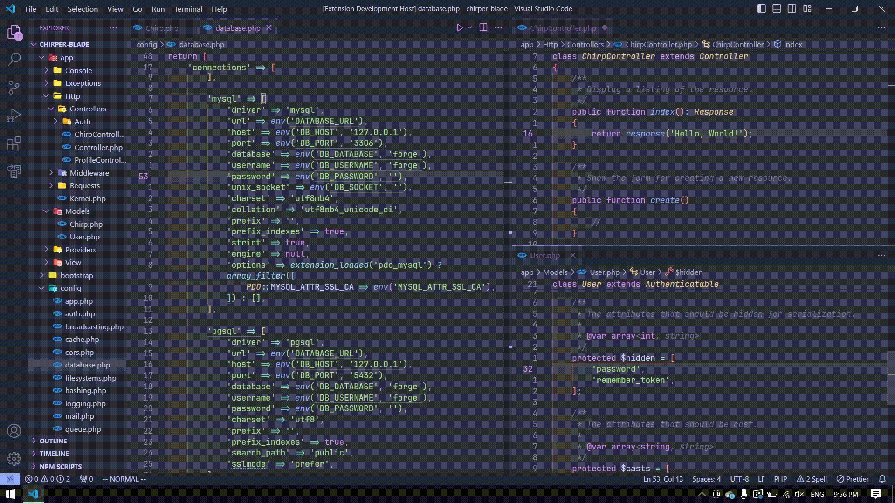
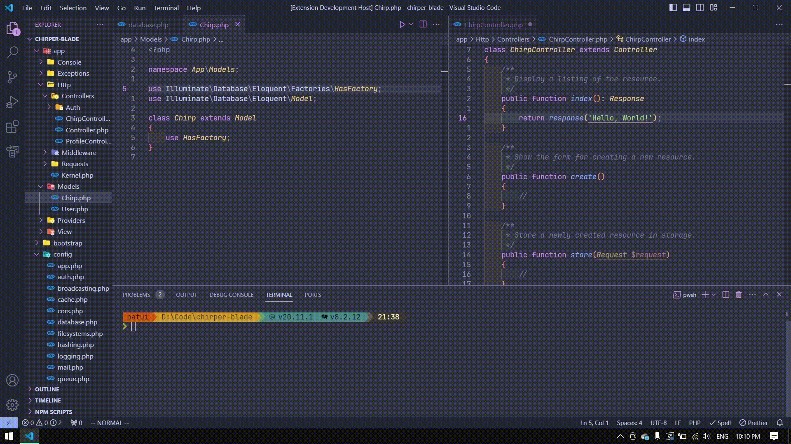
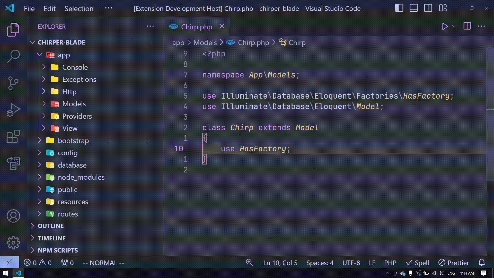

<div align="center">


<br>

<h2>LunarKeymap</h2>

Keymaps for [Vim](https://marketplace.visualstudio.com/items?itemName=vscodevim.vim) and [Which Key](https://marketplace.visualstudio.com/items?itemName=VSpaceCode.whichkey) to enable efficient keyboard-driven workflow for developers. Inspired by LunarVim.

</div>

## 1.0 Installation

Install LunarKeymap via [Visual Studio Marketplace](https://marketplace.visualstudio.com/items?itemName=fathulfahmy.lunarkeymap).

## 2.0 Usage

Full list of shortcuts are available on `Feature Contributions`.

### 2.1 Workspace Navigation



| Key         | Features              |
| ----------- | --------------------- |
| `ctrl+h`    | Move focus left       |
| `ctrl+j`    | Move focus down       |
| `ctrl+k`    | Move focus up         |
| `ctrl+l`    | Move focus right      |
| `alt+j`     | Move focus terminal   |
| `tab`       | Cycle next editor     |
| `shift+tab` | Cycle previous editor |



| Key            | Features                            |
| -------------- | ----------------------------------- |
| `ctrl+j`       | Cycle next suggestion or option     |
| `ctrl+k`       | Cycle previous suggestion or option |
| `ctrl+shift+h` | Increase editor size                |
| `ctrl+shift+l` | Decrease editor size                |

### 2.2 File Explorer



| Key      | Features      |
| -------- | ------------- |
| `ctrl+e` | Open explorer |
| `h`      | Collapse list |
| `j`      | Move down     |
| `k`      | Move up       |
| `l`      | Expand list   |
| `o`      | Expand list   |


| Key       | Features       |
| --------- | -------------- |
| `a`       | Add new file   |
| `shift+a` | Add new folder |
| `d`       | Delete file    |
| `x`       | Cut file       |
| `y`       | Copy file      |
| `p`       | Paste file     |
| `r`       | Rename file    |
| `enter`   | Select file    |

### 2.3 Which Key (Common)


| Key            | Features                  |
| -------------- | ------------------------- |
| `ctrl+space`   | Open shortcut menu        |
| `ctrl+space+;` | Open command palette      |
| `ctrl+space+/` | Toggle comment            |
| `ctrl+space+?` | View all references       |
| `ctrl+space+e` | Toggle file explorer      |
| `ctrl+space+h` | Horizontally split editor |
| `ctrl+space+v` | Vertically split editor   |
| `ctrl+space+m` | Toggle minimap            |
| `ctrl+space+x` | View extensions           |
| `ctrl+space+z` | Toggle zen mode           |

### 2.4 Which Key (Buffers/Editors)


| Key              | Features                           |
| ---------------- | ---------------------------------- |
| `ctrl+space`     | Open shortcut menu                 |
| `ctrl+space+b+n` | Cycle next editor                  |
| `ctrl+space+b+p` | Cycle previous editor              |
| `ctrl+space+b+d` | Close current editor               |
| `ctrl+space+b+u` | Reopen closed editor               |
| `ctrl+space+b+x` | Close other editors                |
| `ctrl+space+b+N` | Open new editor                    |
| `ctrl+space+b+y` | Copy editor to clipboard           |
| `ctrl+space+b+h` | Move current editor to left group  |
| `ctrl+space+b+j` | Move current editor to below group |
| `ctrl+space+b+k` | Move current editor to above group |
| `ctrl+space+b+l` | Move current editor to right group |

### 2.5 Which Key Menu

- Buffer `b`
- Debug `d`
- Find & Replace `f`
- Git `g`
- LSP `l`
- Open `o`
- Peek `p`
- Terminal `t`
- UI toggles `u`
- Window `w`

## 3.0 Defaults

```
"vim.useSystemClipboard": true,
"vim.useCtrlKeys": true,
"vim.easymotion": true,
"vim.incsearch": true,
"vim.hlsearch": true,
"vim.sneak": true,
"vim.handleKeys": {
  "<C-space>": false,
  "<C-e>": false,
  "<C-h>": false,
  "<C-j>": false,
  "<C-k>": false,
  "<C-l>": false,
  "<C-d>": true
}
```

## 4.0 Change Which Key Shortcut Menu Keybinding

1. Open command palette `ctrl+shift+p`
2. Open Keyboard Shortcuts (JSON)
3. Add

```
[
  {
    "key": "ctrl+space",
    "command": "whichkey.show"

  },

  // replace ctrl+space with your keybinding e.g.

  {
    "key": "ctrl+w",
    "command": "whichkey.show"
  },
]
```

4. Save file `ctrl+s`
5. Open command palette `ctrl+shift+p`
6. Open User Settings (JSON)
7. Add

```
"vim.handleKeys": {
  "<C-space>": false,
},

// replace ctrl+space with your keybinding

"vim.handleKeys": {
  "<C-w>": false,
},
```

8. Save user settings `ctrl+s`

## 5.0 Known Issues

### Integration with Neovim

This extension does not support vscode/vim neovim mode or any other neovim extension.  
Configuration to both VS Code and user's Neovim is required in order for Neovim to work.  
VS Code extensions do not have access to user's application (Neovim).  
Follow Chris Chiarulli's tutorial on [how to embed Neovim in VS Code](https://www.youtube.com/watch?v=g4dXZ0RQWdw).

## 6.0 Contributing

1. Go to LunarKeymap [GitHub repository](https://github.com/fathulfahmy/lunarkeymap).
2. Open [package.json](https://github.com/fathulfahmy/lunarkeymap/blob/main/package.json).
3. Add JSON object to [contributes.configurationDefaults](https://github.com/fathulfahmy/lunarkeymap/blob/main/package.json) or [contributes.keybindings](https://github.com/fathulfahmy/lunarkeymap/blob/main/package.json).
4. Open a pull request.

## 7.0 License

This extension is licensed under the [MIT License](https://github.com/fathulfahmy/lunarkeymap/blob/main/LICENSE).

## 8.0 Special thanks

- [LunarVim](https://github.com/LunarVim/LunarVim/tree/4625145d0278d4a039e55c433af9916d93e7846a/utils/vscode_config)
- [Christian Chiarulli](https://www.youtube.com/watch?v=g4dXZ0RQWdw)
- [Joaquin Varela](https://www.youtube.com/watch?v=Vkm4bc2Y0AA&t=215s)
