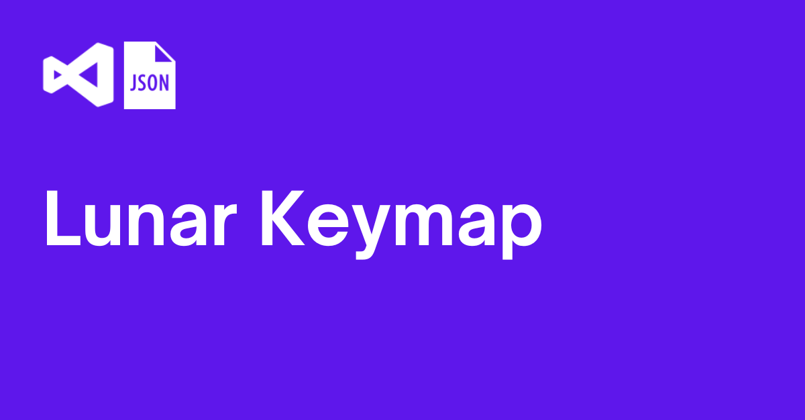
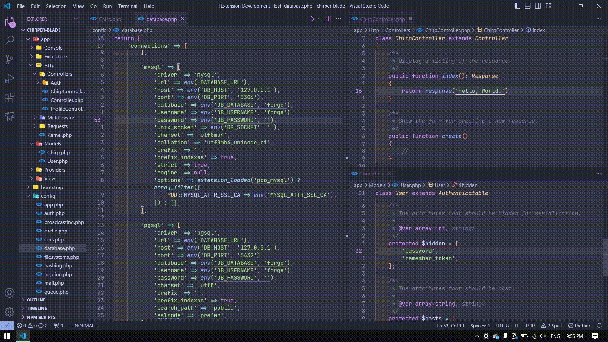
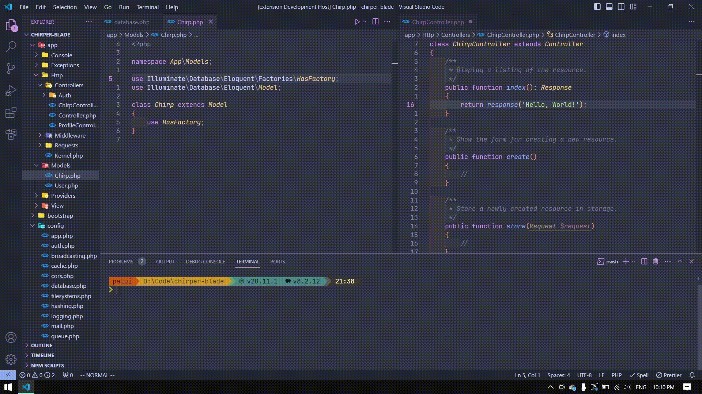
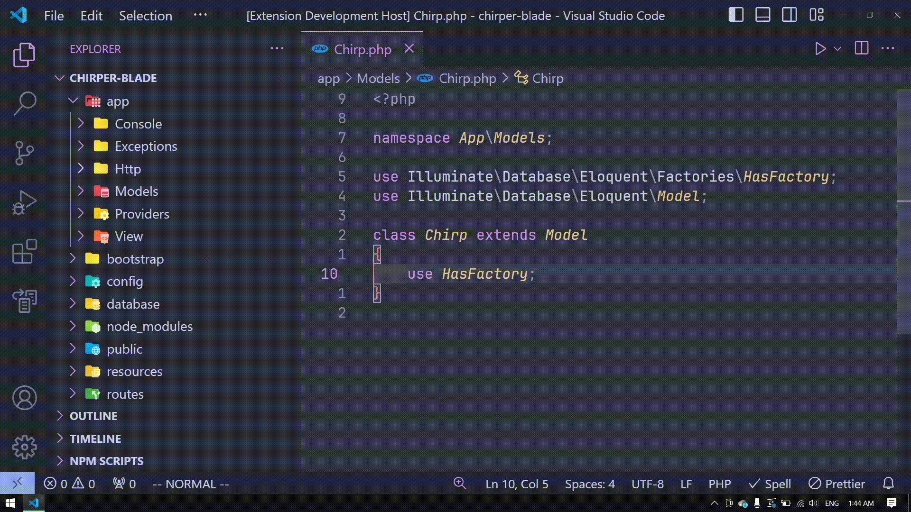

<a id="readme-top"></a>

<!-- PROJECT SHIELDS -->

[![Contributors][contributors-shield]][contributors-url]
[![Forks][forks-shield]][forks-url]
[![Stargazers][stars-shield]][stars-url]
[![Issues][issues-shield]][issues-url]
[![MIT License][license-shield]][license-url]
[![LinkedIn][linkedin-shield]][linkedin-url]

<!-- PROJECT LOGO -->

<br />

<div align="center">
  <a href="https://github.com/fathulfahmy/lunarkeymap">
    
  </a>

  <h3 align="center">Lunar Keymap</h3>

  <p align="center">
    Enhancing developer experience by enabling a keyboard-driven workflow. Inspired by LunarVim.
    <br />
    <br />
    <a href="https://github.com/fathulfahmy/lunarkeymap/issues/new?labels=bug&template=bug-report---.md">Report Bug</a>
    &middot;
    <a href="https://github.com/fathulfahmy/lunarkeymap/issues/new?labels=enhancement&template=feature-request---.md">Request Feature</a>
  </p>
</div>

<!-- TABLE OF CONTENTS -->

## Table of Contents

<ol>
  <li><a href="#about-the-project">About The Project</a></li>
  <li>
    <a href="#getting-started">Getting Started</a>
    <ul>
      <li><a href="#prerequisites">Prerequisites</a></li>
      <li><a href="#installation">Installation</a></li>
    </ul>
  </li>
  <li>
    <a href="#usage">Usage</a>
    <ul>
      <li><a href="#editor-navigation">Editor Navigation</a></li>
      <li><a href="#explorer-navigation">Explorer Navigation</a></li>
      <li><a href="#menu-common">Menu (Common)</a></li>
      <li><a href="#menu-editor">Menu (Editor)</a></li>
      <li><a href="#menu-others">Menu (Others)</a></li>
      <li><a href="#default-settings">Default Settings</a></li>
      <li><a href="#change-menu-shortcut">Change Menu Shortcut</a></li>
    </ul>
  </li>
  <li><a href="#known-issues">Known Issues</a></li>
  <li><a href="#contributing">Contributing</a></li>
  <li><a href="#license">License</a></li>
  <li><a href="#contact">Contact</a></li>
  <li><a href="#acknowledgments">Acknowledgments</a></li>
</ol>

<!-- ABOUT THE PROJECT -->

## About The Project



LunarKeymap is a Visual Studio Code extension to enhance developer experience by enabling a keyboard-driven workflow. Features include code editor navigation, file and folder creation, component visibility toggles, debugging and git keybindings, and many more.

<p align="right">(<a href="#readme-top">back to top</a>)</p>

<!-- GETTING STARTED -->

## Getting Started

### Prerequisites

- Visual Studio Code

### Installation

Install LunarKeymap via [Visual Studio Marketplace](https://marketplace.visualstudio.com/items?itemName=fathulfahmy.lunarkeymap).

<p align="right">(<a href="#readme-top">back to top</a>)</p>

<!-- USAGE EXAMPLES -->

## Usage

Full list of shortcuts are available on `Feature Contributions`.

### Editor Navigation



| Key         | Features              |
| ----------- | --------------------- |
| `ctrl+h`    | Move focus left       |
| `ctrl+j`    | Move focus down       |
| `ctrl+k`    | Move focus up         |
| `ctrl+l`    | Move focus right      |
| `alt+j`     | Move focus terminal   |
| `tab`       | Cycle next editor     |
| `shift+tab` | Cycle previous editor |



| Key            | Features                            |
| -------------- | ----------------------------------- |
| `ctrl+j`       | Cycle next suggestion or option     |
| `ctrl+k`       | Cycle previous suggestion or option |
| `ctrl+shift+h` | Increase editor size                |
| `ctrl+shift+l` | Decrease editor size                |

<p align="right">(<a href="#readme-top">back to top</a>)</p>

### Explorer Navigation



| Key      | Features      |
| -------- | ------------- |
| `ctrl+e` | Open explorer |
| `h`      | Collapse list |
| `j`      | Move down     |
| `k`      | Move up       |
| `l`      | Expand list   |
| `o`      | Expand list   |


| Key       | Features       |
| --------- | -------------- |
| `a`       | Add new file   |
| `shift+a` | Add new folder |
| `d`       | Delete file    |
| `x`       | Cut file       |
| `y`       | Copy file      |
| `p`       | Paste file     |
| `r`       | Rename file    |
| `enter`   | Select file    |

<p align="right">(<a href="#readme-top">back to top</a>)</p>

### Menu (Common)


| Key            | Features                  |
| -------------- | ------------------------- |
| `ctrl+space`   | Open shortcut menu        |
| `ctrl+space+;` | Open command palette      |
| `ctrl+space+/` | Toggle comment            |
| `ctrl+space+?` | View all references       |
| `ctrl+space+e` | Toggle file explorer      |
| `ctrl+space+h` | Horizontally split editor |
| `ctrl+space+v` | Vertically split editor   |
| `ctrl+space+m` | Toggle minimap            |
| `ctrl+space+x` | View extensions           |
| `ctrl+space+z` | Toggle zen mode           |

<p align="right">(<a href="#readme-top">back to top</a>)</p>

### Menu (Editor)


| Key              | Features                           |
| ---------------- | ---------------------------------- |
| `ctrl+space`     | Open shortcut menu                 |
| `ctrl+space+b+n` | Cycle next editor                  |
| `ctrl+space+b+p` | Cycle previous editor              |
| `ctrl+space+b+d` | Close current editor               |
| `ctrl+space+b+u` | Reopen closed editor               |
| `ctrl+space+b+x` | Close other editors                |
| `ctrl+space+b+N` | Open new editor                    |
| `ctrl+space+b+y` | Copy editor to clipboard           |
| `ctrl+space+b+h` | Move current editor to left group  |
| `ctrl+space+b+j` | Move current editor to below group |
| `ctrl+space+b+k` | Move current editor to above group |
| `ctrl+space+b+l` | Move current editor to right group |

<p align="right">(<a href="#readme-top">back to top</a>)</p>

### Menu (Others)

- Buffer `b`
- Debug `d`
- Find & Replace `f`
- Git `g`
- LSP `l`
- Open `o`
- Peek `p`
- Terminal `t`
- UI toggles `u`
- Window `w`

<p align="right">(<a href="#readme-top">back to top</a>)</p>

### Default Settings

```json
"vim.useSystemClipboard": true,
"vim.useCtrlKeys": true,
"vim.easymotion": true,
"vim.incsearch": true,
"vim.hlsearch": true,
"vim.sneak": true,
"vim.handleKeys": {
  "<C-space>": false,
  "<C-e>": false,
  "<C-h>": false,
  "<C-j>": false,
  "<C-k>": false,
  "<C-l>": false,
  "<C-d>": true
}
```

<p align="right">(<a href="#readme-top">back to top</a>)</p>

### Change Menu Shortcut

1. Open command palette `ctrl+shift+p`
2. Open Keyboard Shortcuts (JSON)
3. Add

```json
[
  {
    "key": "ctrl+space",
    "command": "whichkey.show"
  },

  // replace ctrl+space with your keybinding e.g.

  {
    "key": "ctrl+w",
    "command": "whichkey.show"
  }
]
```

4. Save file `ctrl+s`
5. Open command palette `ctrl+shift+p`
6. Open User Settings (JSON)
7. Add

```json
"vim.handleKeys": {
  "<C-space>": false,
},

// replace ctrl+space with your keybinding e.g.

"vim.handleKeys": {
  "<C-w>": false,
},
```

8. Save user settings `ctrl+s`

<p align="right">(<a href="#readme-top">back to top</a>)</p>

<!-- KNOWN ISSUES -->

## Known Issues

This extension does not currently support VS Code's Vim Neovim mode or any other Neovim extensions. To use Neovim within VS Code, both VS Code and the user's Neovim configuration must be set up. Since VS Code extensions do not have direct access to external applications such as Neovim, additional configuration is required for integration.

For detailed guidance on embedding Neovim in VS Code, refer to [Chris Chiarulli's tutorial](https://www.youtube.com/watch?v=g4dXZ0RQWdw).

<p align="right">(<a href="#readme-top">back to top</a>)</p>

<!-- CONTRIBUTING -->

## Contributing

Contributions are what make the open source community such an amazing place to learn, inspire, and create. Any contributions you make are **greatly appreciated**.

If you have a suggestion that would make this better, please fork the repo and create a pull request. You can also simply open an issue with the tag "enhancement".
Don't forget to give the project a star! Thanks again!

1. Go to LunarKeymap [GitHub repository](https://github.com/fathulfahmy/lunarkeymap).
2. Open [package.json](https://github.com/fathulfahmy/lunarkeymap/blob/main/package.json).
3. Add JSON object to `contributes.configurationDefaults` or `contributes.keybindings`.
4. Open a pull request.

### Top contributors:

<a href="https://github.com/fathulfahmy/lunarkeymap/graphs/contributors">
  
</a>

<p align="right">(<a href="#readme-top">back to top</a>)</p>

<!-- LICENSE -->

## License

Distributed under the MIT License. See `LICENSE.md` for more information.

<p align="right">(<a href="#readme-top">back to top</a>)</p>

<!-- CONTACT -->

## Contact

Fathul Fahmy - [@fathulfahmy](https://linkedin.com/in/fathulfahmy) - mfathulfahmy@gmail.com

Download Link: [https://marketplace.visualstudio.com/items?itemName=fathulfahmy.lunarkeymap](https://marketplace.visualstudio.com/items?itemName=fathulfahmy.lunarkeymap)

Project Link: [https://github.com/fathulfahmy/lunarkeymap](https://github.com/fathulfahmy/lunarkeymap)

<p align="right">(<a href="#readme-top">back to top</a>)</p>

<!-- ACKNOWLEDGMENTS -->

## Acknowledgments

- [LunarVim](https://github.com/LunarVim/LunarVim/tree/4625145d0278d4a039e55c433af9916d93e7846a/utils/vscode_config)
- [Christian Chiarulli](https://www.youtube.com/watch?v=g4dXZ0RQWdw)
- [Joaquin Varela](https://www.youtube.com/watch?v=Vkm4bc2Y0AA&t=215s)

<p align="right">(<a href="#readme-top">back to top</a>)</p>

<!-- MARKDOWN LINKS & IMAGES -->
<!-- https://www.markdownguide.org/basic-syntax/#reference-style-links -->

[contributors-shield]: https://img.shields.io/github/contributors/fathulfahmy/lunarkeymap.svg?style=for-the-badge
[contributors-url]: https://github.com/fathulfahmy/lunarkeymap/graphs/contributors
[forks-shield]: https://img.shields.io/github/forks/fathulfahmy/lunarkeymap.svg?style=for-the-badge
[forks-url]: https://github.com/fathulfahmy/lunarkeymap/network/members
[stars-shield]: https://img.shields.io/github/stars/fathulfahmy/lunarkeymap.svg?style=for-the-badge
[stars-url]: https://github.com/fathulfahmy/lunarkeymap/stargazers
[issues-shield]: https://img.shields.io/github/issues/fathulfahmy/lunarkeymap.svg?style=for-the-badge
[issues-url]: https://github.com/fathulfahmy/lunarkeymap/issues
[license-shield]: https://img.shields.io/github/license/fathulfahmy/lunarkeymap.svg?style=for-the-badge
[license-url]: https://github.com/fathulfahmy/lunarkeymap/blob/master/LICENSE.md
[linkedin-shield]: https://img.shields.io/badge/-LinkedIn-black.svg?style=for-the-badge&logo=linkedin&colorB=555
[linkedin-url]: https://linkedin.com/in/fathulfahmy
